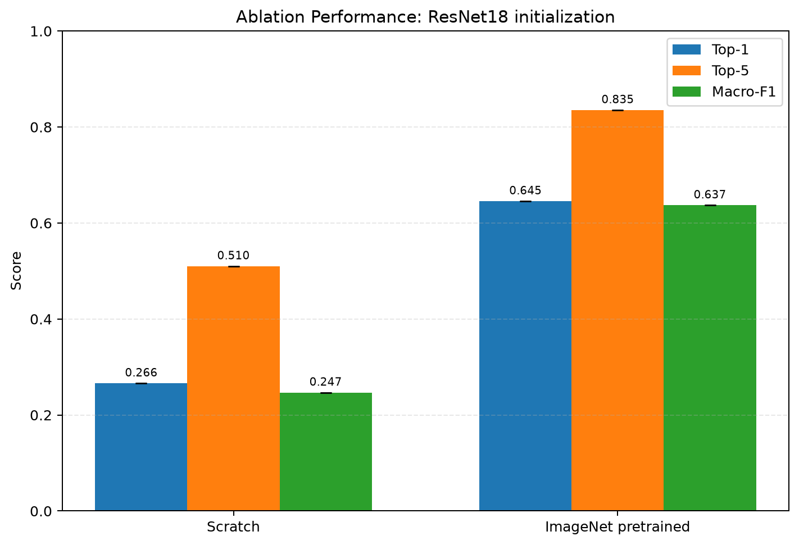
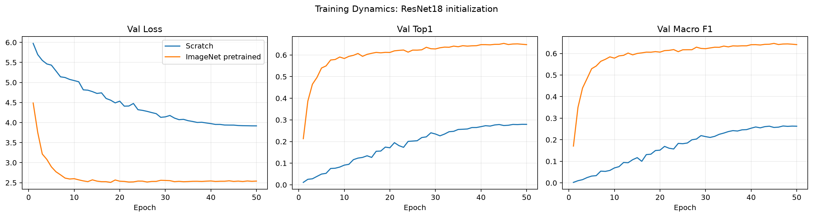
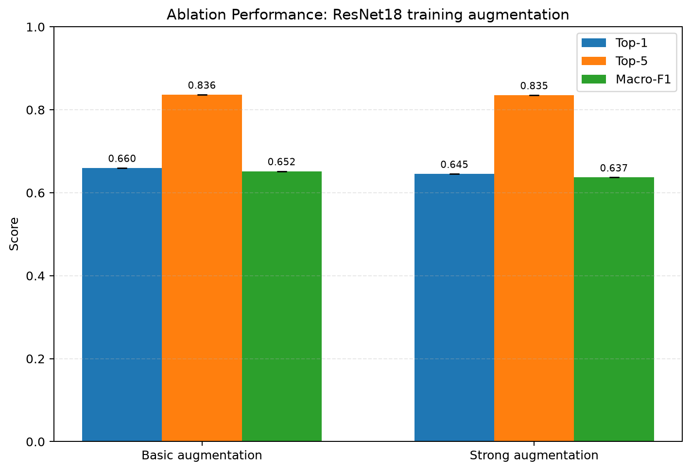
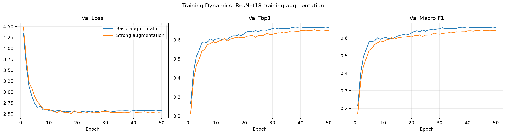
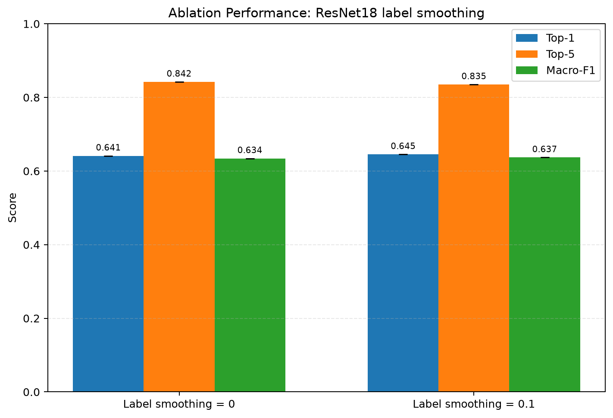
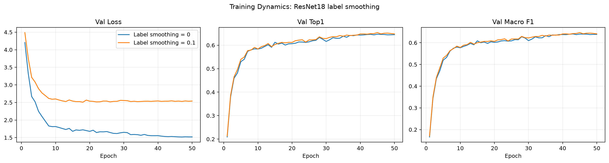
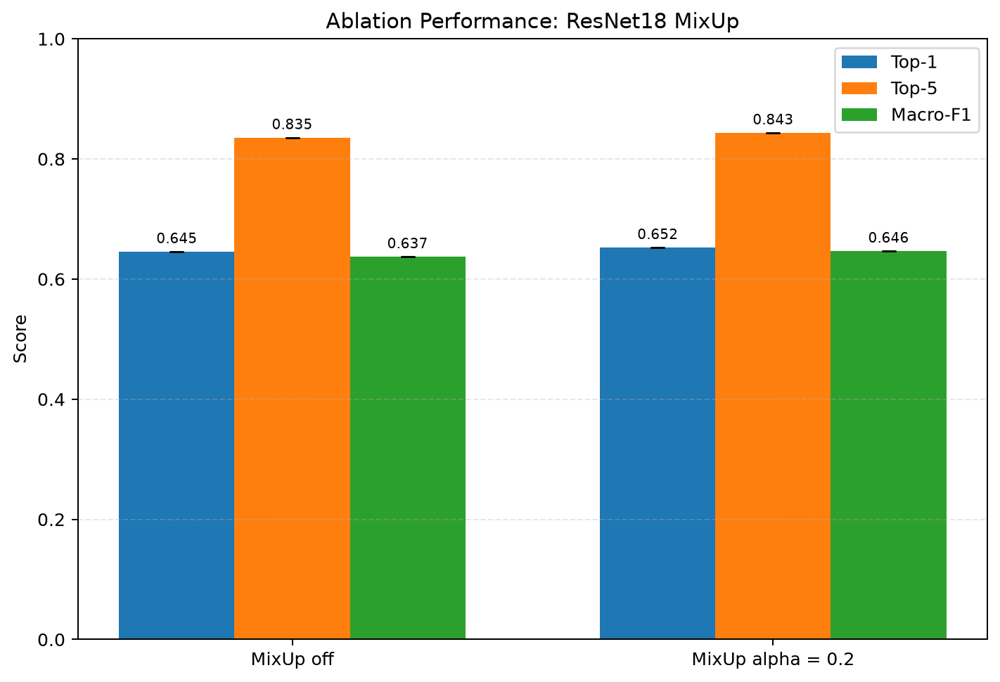
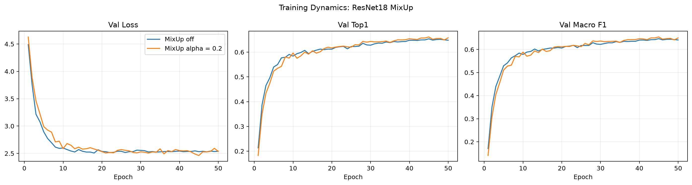
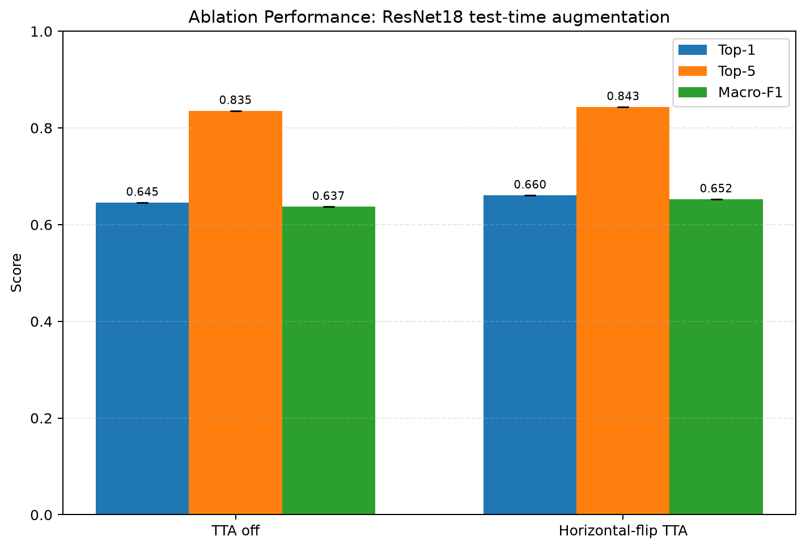
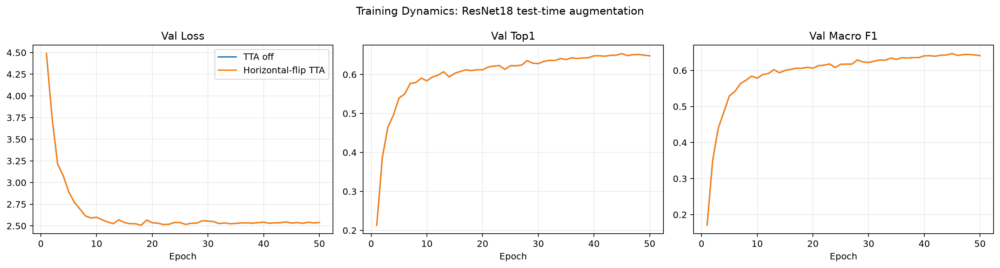

# 深度学习控制变量消融实验

## 实验目的

本实验严格遵循一次只改变一个变量的原则，使用固定的500类数据划分和ResNet18训练预算，分别研究初始化、数据增强、Label Smoothing、MixUp和测试时增强（TTA）。所有结果均由实际测试集预测CSV重新计算验证。

## 固定设置

| 设置 | 数值 |
|---|---:|
| `image_size` | `224` |
| `epochs` | `50` |
| `batch_size` | `512` |
| `eval_batch_size` | `1024` |
| `lr` | `0.0003` |
| `weight_decay` | `0.0001` |
| `scheduler` | `cosine` |
| `early_stopping_patience` | `8` |
| `early_stopping_min_delta` | `0.0005` |
| `cuda_memory_fraction` | `1.0` |
| 随机种子 | `9517` |
| 数据划分 | 500类；20,000训练、5,000验证、5,000测试 |

## 实验结果

### ResNet18 initialization

唯一变化变量：`initialization`。

| 方案 | Top-1 | Top-5 | Macro-F1 | 运行次数 |
|---|---:|---:|---:|---:|
| Scratch | 26.60% | 51.00% | 24.67% | 1 |
| ImageNet pretrained | 64.54% | 83.52% | 63.69% | 1 |

相对表中基线，最后一个方案的变化为：Top-1 `+37.94` 个百分点，Top-5 `+32.52` 个百分点，Macro-F1 `+39.02` 个百分点。

结论：ImageNet预训练带来最大的性能提升，并显著加快收敛；在每类仅40张训练图片时，从随机初始化学习完整视觉表征明显受限。

### ResNet18 training augmentation

唯一变化变量：`augmentation`。

| 方案 | Top-1 | Top-5 | Macro-F1 | 运行次数 |
|---|---:|---:|---:|---:|
| Basic augmentation | 65.98% | 83.64% | 65.19% | 1 |
| Strong augmentation | 64.54% | 83.52% | 63.69% | 1 |

相对表中基线，最后一个方案的变化为：Top-1 `-1.44` 个百分点，Top-5 `-0.12` 个百分点，Macro-F1 `-1.50` 个百分点。

结论：Basic augmentation优于当前Strong方案，说明RandAugment与Random Erasing的组合对这个小样本细粒度任务偏强，可能破坏了区分相近物种所需的局部纹理。

### ResNet18 label smoothing

唯一变化变量：`label_smoothing`。

| 方案 | Top-1 | Top-5 | Macro-F1 | 运行次数 |
|---|---:|---:|---:|---:|
| Label smoothing = 0 | 64.14% | 84.22% | 63.44% | 1 |
| Label smoothing = 0.1 | 64.54% | 83.52% | 63.69% | 1 |

相对表中基线，最后一个方案的变化为：Top-1 `+0.40` 个百分点，Top-5 `-0.70` 个百分点，Macro-F1 `+0.25` 个百分点。

结论：Label Smoothing=0.1小幅提高Top-1和Macro-F1，但Top-5下降；它改善了最佳类别判断，却没有同时改善候选类别排序。

### ResNet18 MixUp

唯一变化变量：`mixup_alpha`。

| 方案 | Top-1 | Top-5 | Macro-F1 | 运行次数 |
|---|---:|---:|---:|---:|
| MixUp off | 64.54% | 83.52% | 63.69% | 1 |
| MixUp alpha = 0.2 | 65.22% | 84.32% | 64.64% | 1 |

相对表中基线，最后一个方案的变化为：Top-1 `+0.68` 个百分点，Top-5 `+0.80` 个百分点，Macro-F1 `+0.95` 个百分点。

结论：MixUp alpha=0.2在三个主要指标上均有提升，是有效但幅度较温和的训练正则化。

### ResNet18 test-time augmentation

唯一变化变量：`tta`。

| 方案 | Top-1 | Top-5 | Macro-F1 | 运行次数 |
|---|---:|---:|---:|---:|
| TTA off | 64.54% | 83.52% | 63.69% | 1 |
| Horizontal-flip TTA | 66.04% | 84.32% | 65.25% | 1 |

相对表中基线，最后一个方案的变化为：Top-1 `+1.50` 个百分点，Top-5 `+0.80` 个百分点，Macro-F1 `+1.56` 个百分点。

结论：对完全相同的最佳checkpoint使用水平翻转TTA，无需重新训练即可获得本组最大的额外增益；代价是测试时需要两次前向计算。

## 文件说明

- 每个子目录的 `study.json` 定义唯一允许变化的参数。
- `validation_report.json` 记录控制变量检查结果。
- `ablation_runs.csv` 保存每次真实运行的指标和路径。
- `ablation_summary.csv` 与 `ablation_deltas.csv` 用于报告制表。
- 每个方案目录保存配置、训练历史、预测、每类指标和必要图表。

## 限制

受计算预算限制，每个配置当前使用一个固定随机种子，因此这里展示的是严格可复现的单次受控比较，不能将差异解释为多随机种子统计显著性结论。
