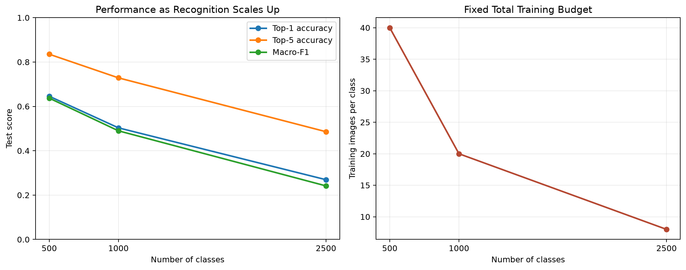
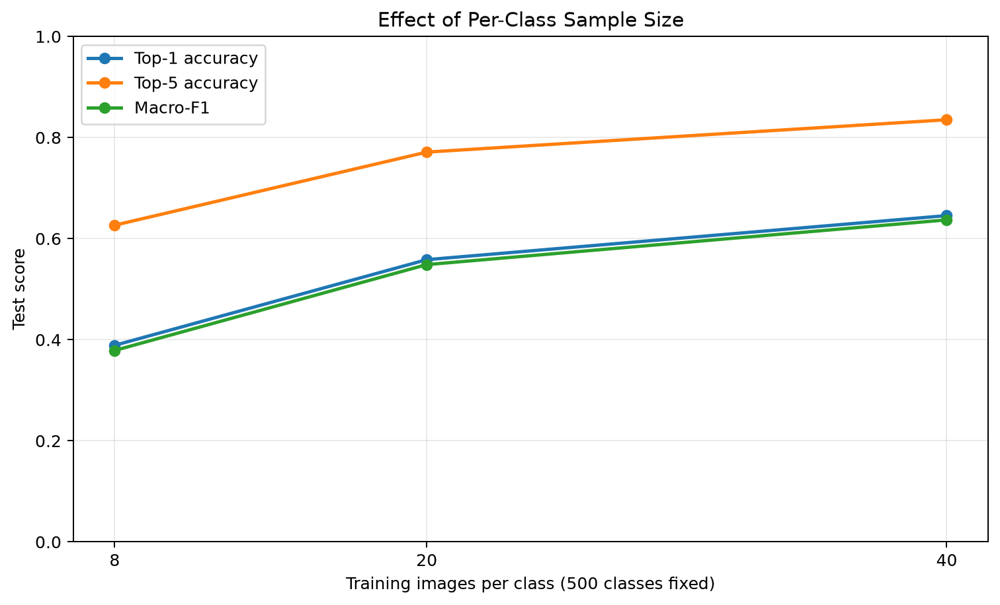
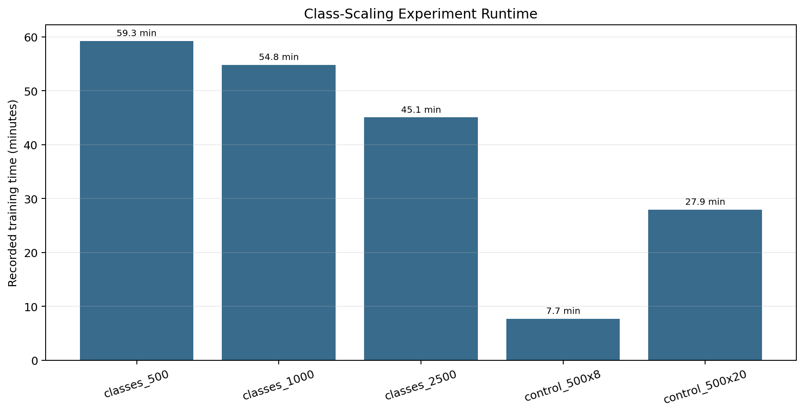

# Advanced：类别数量扩展实验

## 对应作业要求

本实验对应项目说明中的 Advanced Method Development 第3项“Effect of the number of classes”。基础结果仍然报告在原500类测试集上；1,000类和2,500类数据仅用于规模扩展研究。

## 数据构造

随机种子固定为 `9517`。1,000类完整包含基础500类，2,500类完整包含前1,000类。主实验保持训练、验证和测试图片总量分别约为20,000、5,000和5,000，并随类别增加减少每类图片数。

| 实验 | 类型 | 类别数 | 训练/类 | 验证/类 | 测试/类 | 训练总数 |
|---|---|---:|---:|---:|---:|---:|
| `classes_500` | main | 500 | 40 | 10 | 10 | 20000 |
| `classes_1000` | main | 1000 | 20 | 5 | 5 | 20000 |
| `classes_2500` | main | 2500 | 8 | 2 | 2 | 20000 |
| `control_500x20` | sample_control | 500 | 20 | 5 | 10 | 10000 |
| `control_500x8` | sample_control | 500 | 8 | 2 | 10 | 4000 |

## 固定模型与训练设置

所有规模使用同一个ImageNet预训练ResNet18配置并独立从相同预训练权重开始，不从500类checkpoint继续训练。除数据划分和输出类别数外，优化器、学习率、增强、epoch上限、early-stop规则和随机种子保持一致。

## 实际结果

| 实验 | 最佳/完成epoch | Top-1 | Top-5 | Macro-F1 | 训练时间 | 峰值显存 |
|---|---:|---:|---:|---:|---:|---:|
| `classes_500` | 45/50 | 64.56% | 83.52% | 63.71% | 59.3分钟 | 9704 MiB |
| `classes_1000` | 44/50 | 50.32% | 72.86% | 48.98% | 54.8分钟 | 9704 MiB |
| `classes_2500` | 33/41 | 26.94% | 48.58% | 24.15% | 45.1分钟 | 9719 MiB |
| `control_500x20` | 41/49 | 55.84% | 77.12% | 54.86% | 27.9分钟 | 9703 MiB |
| `control_500x8` | 20/28 | 38.90% | 62.66% | 37.88% | 7.7分钟 | 9480 MiB |

## 如何解读

- `classes_500 → classes_1000 → classes_2500` 同时体现类别更细和单类样本减少的综合影响，同时总训练图片量基本固定。
- `classes_500 → control_500x20 → control_500x8` 固定500类，用于单独观察每类训练样本减少造成的影响。
- 对比 `control_500x20` 与 `classes_1000`，以及`control_500x8` 与 `classes_2500`，可以辅助判断类别数量增加的影响。

## 结果分析

- 主规模实验从500类增加到1,000类时，Top-1变化`-14.24`个百分点，Macro-F1变化`-14.73`个百分点。
- 从1,000类继续增加到2,500类时，Top-1变化`-23.38`个百分点，Macro-F1变化`-24.84`个百分点，下降幅度进一步扩大。
- 固定500类，仅把每类训练图片从40减到20时，Top-1变化`-8.72`个百分点；减到8张时变化`-25.66`个百分点。这证明单类样本减少本身就是主要性能瓶颈。
- 固定每类20张，对比500类和1,000类，类别翻倍额外造成Top-1`-5.52`个百分点、Macro-F1`-5.88`个百分点变化。
- 固定每类8张，对比500类和2,500类，类别增加额外造成Top-1`-11.96`个百分点、Macro-F1`-13.73`个百分点变化。

综合来看，类别增多和单类样本减少都会降低性能；在本实验中，单类样本降到8张造成的影响尤其明显，而类别扩展又进一步加剧了细粒度物种之间的混淆。

## 可复现文件

每个子集都保存 `train.csv`、`val.csv`、`test.csv`、`selected_classes.csv`、`class_mapping.json` 和 `split_summary.json`。`split_summary.json` 记录数量、随机种子和SHA-256；`reproducibility/validation_report.json` 记录嵌套与数据交叉检查。

每个运行目录均保存 `test_predictions_top5.csv`，其中包含每张测试图片的`pred_1` 至 `pred_5` 及对应概率。Top-1、Top-5和Macro-F1均从逐图预测独立复算，结果见 `prediction_validation.json` 和`top5_prediction_validation.json`。

`top1_wrong_top5_correct.csv` 完整列出Top-1预测错误但真实类别仍位于Top-5的样本；`top1_wrong_top5_correct.png` 提供可直接用于报告的案例图。

本实验使用一个固定随机种子，结论适合作为严格可复现的受控趋势，但不等同于多随机种子的统计显著性分析。
